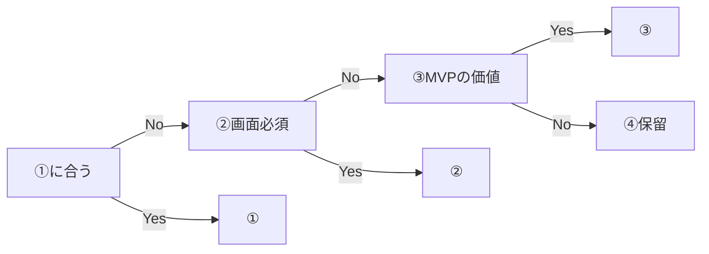

# デモポートフォリオ運用（①②③④・保留ランク）

最終更新: 2026-03-26

本ドキュメントは、デモを **①文章カタログ／②体験／③プロダクト／④保留** の4軸で管理するための**単一の運用ルール**です。品質チェックは引き続き [demo-mock-quality-gate.md](demo-mock-quality-gate.md) を参照してください。

## `/demo` ハブの4段構成

サイトの `/demo`（体験・ツールdemoハブ）は、情報提供を読みやすい画面で見せることを優先し、次の順でセクションを固定する。

| 段 | 内容 | 役割 |
|----|------|------|
| 1 | Featured（注力2件） | `FEATURED_EXPERIENCE_SLUGS`（社内ナレッジBOT・飲食ダッシュボード） |
| 2 | **タイプ別に体験する** | 形式の違いを並べて比較（PC: 3列×2行）。固定6件は [`src/lib/experience/prototype-registry.ts`](../src/lib/experience/prototype-registry.ts) の `DEMO_HUB_TYPE_SECTION_SLUGS`。バッジ文言は [`src/lib/demo/demo-hub-sections.ts`](../src/lib/demo/demo-hub-sections.ts) の `DEMO_HUB_TYPE_SECTION_BADGES`。トップページも同一 [`TypeExperienceSection`](../src/components/demo/TypeExperienceSection.tsx) を埋め込み |
| 3 | **目的から選ぶ** | 業務ゴール別4目的・タップでおすすめ体験最大3件をシート表示。定義は [`demo-hub-sections.ts`](../src/lib/demo/demo-hub-sections.ts) の `DEMO_HUB_PURPOSE_GROUPS`。一覧へは [`/demo/list?concierge=1`](../src/app/demo/list/page.tsx) でコンシェルジュを自動表示（[`DemoListConciergeUrlSync`](../src/components/demo/DemoListConciergeUrlSync.tsx)） |
| 4 | **モックdemo一覧で網羅探索** | `/demo/list` へ誘導。100本規模の横断・コンシェルジュ絞り込みの入口 |

「その他のインタラクティブ体験」では、上記 Featured とタイプ別固定6件を**重複表示しない**（レジストリから除外して一覧）。

`listedOnCatalog: false` は主に **`/demo/list` のカタログとコンシェルジュ候補**から除外する用途。`/demo` ハブの Featured・タイプ別・目的別はコード固定のため、個別slugのカタログ非表示とは役割が異なる。

## 関連ドキュメント

| ドキュメント | 用途 |
|-------------|------|
| [demo-portfolio-triage.md](demo-portfolio-triage.md) | slug 単位の主ラベル・保留ランク・理由の**トリアージ表**（SSOT の一つ） |
| [demo-mock-inventory.md](demo-mock-inventory.md) | 作成済み一覧・重複防止・taxonomy |
| [demo-mock-quality-gate.md](demo-mock-quality-gate.md) | 1本あたりの品質チェックリスト |
| [新規デモ追加手順.md](新規デモ追加手順.md) | Sanity / シードでの追加手順 |
| [demo-titles-and-purpose.md](demo-titles-and-purpose.md) | タイトル・説明・目的の一覧（再生成: `npx tsx scripts/generate-demo-titles-md.ts`） |

## 主ラベル（1 slug につき原則1つ）

| 記号 | 名称 | 目的（1行） | 成功のイメージ |
|------|------|-------------|----------------|
| ① | 文章デモ（カタログ） | 多様なシーンで「こういう系ができる」が伝わる | **成果物が文章で完結**し、入力がテキスト（＋音声・画像のメタ付き）で**自分ごと化**しやすい |
| ② | 体験 | 魅力・納得・操作イメージ | **画面を見せないと価値が伝わらない**。DB なしの軽量デモでよい。薄く・速く作る |
| ③ | プロダクト | 導入判断・見積の材料 | **1ワークフローに絞った MVP**。誰が・何を減らすか・スコープが一言で言える |

**社内チャットボット等を③に載せる場合**（汎用 RAG で終わらせないための必須1行）:

- **差し替える情報源は何か**（例: Notion / PDF マニュアル / 社内規程）
- **誰の・どんな質問・作業が減るか**（例: 総務の規程問い合わせ初回対応）

| 記号 | 名称 | 目的（1行） |
|------|------|-------------|
| ④ | 保留 | 即アーカイブせず、改善・需要・難易度を見極める |

**ルール**: 各デモは **`primaryPortfolioTrack` は1つだけ**。②③ 用 URL やメモはサブ情報として同一行に書く（多重登録で別案として並べない）。

## 評価の順序（固定）

1. **①の基準に合うか**（成果物が文章中心か、入力が自分ごと化しやすいか）。
2. ①に合わない → **すぐ④に落とさない**。**②**（画面必須か）を検討する。
3. ②でも弱い／投資対効果が高い → **③** 候補、または **④**。
4. **④** に入れたものは **保留理由タグ** と **A〜D ランク** を付け、「次に何を工夫すれば①〜③に昇格するか」を残す。

**②と③の線引き**

- **②**: 主目的は **魅力の伝達**（納得・イメージ）。実装は薄く・速く。
- **③**: 主目的は **導入判断・見積の材料**。スコープと効果が言語化できる。

同じアイデアが B（体験で救出）と C（フローで救出）の両方に見える場合は、**まず②の薄い体験で検証 → 需要が見えたら③の1フローに絞る**。

## ④保留ランク A〜D

**判断次元**（各項目にメモを取り、**総合**でランクを確定する）:

| 次元 | 見ること |
|------|----------|
| 需要の予測 | 想定業種・頻度・既存ツールとの差分（高／中／低） |
| デモ作成難易度 | ①文章／②体験／③フロー MVP のどれが現実的か（低／中／高） |
| ユーザーへのわかりやすさ | タイトル・1アクション・出力で **30秒で理解**できるか（[demo-mock-quality-gate.md](demo-mock-quality-gate.md) と整合） |

**ランク定義**

| ランク | 意味 |
|--------|------|
| **A** | 工夫すれば **①文章デモ**（出力完結）で使える見込みが高い |
| **B** | 工夫すれば **②体験型**（画面・操作）で伝わる見込みが高い |
| **C** | 工夫すれば **フロー／複数ステップ**（状態・画面遷移が本体）で価値が出る見込み。③手前の「救出ルート」 |
| **D** | **削除優先**（需要・説明可能性・コストのいずれかが構造的に弱い） |

**削除候補（D 確定）**は [demo-portfolio-triage.md](demo-portfolio-triage.md) の「削除候補リスト」に集約し、実行時は本書の「削除／非表示」チェックリストに従う。

## 保留理由タグ（例）

運用で使う値の例（必要に応じて追加可）:

- `需要不明`
- `成果物曖昧`
- `規制・個人情報`
- `入力が重い`
- `タイトル説明UI不整合`
- `モックが意図と無関係`

## 真実のソース（SSOT）

| 対象 | 推奨 SSOT | 備考 |
|------|-----------|------|
| トリアージ（主ラベル・④ランク・理由） | [demo-portfolio-triage.md](demo-portfolio-triage.md) | 週次バッチで更新可（推奨: 週あたり 10〜25 本） |
| slug・技術メタ（inputType 等） | [demo-mock-inventory.md](demo-mock-inventory.md) と Sanity `aiDemo` | 追加・削除時に両方同期 |
| サイトの一覧非表示 | Sanity の **`listedOnCatalog`** | `false` のドキュメントは `/demo` 一覧・コンシェルジュ結合リストから除外（詳細 URL 直叩きは開発方針で決定） |

**Sanity とシードの関係**: リポジトリの [`scripts/seed-ai-demos.ts`](../scripts/seed-ai-demos.ts) は再投入用。運用の正は **Sanity の実データ + 本トリアージ表** とし、シードを更新した場合は `demo-mock-inventory.md` と整合を取る。

## Sanity フィールド（ポートフォリオ）

`aiDemo` に以下を追加している（Studio で編集）:

- `primaryPortfolioTrack`: `catalog_text` | `experience` | `product` | `hold`
- `experienceUrl`: ②用の外部 URL
- `holdRank`: `A` | `B` | `C` | `D`（主に④で使用）
- `holdReasonTags`: 保留理由（複数可）
- `listedOnCatalog`: `false` で `/demo` 一覧・デモ取得クエリから除外（未設定は **表示**）

トリアージ表と Studio の値がずれたら、**表または CMS のどちらかを正にして片方へ反映**する。

## 追加時チェックリスト

- [ ] **主ラベル**を1つ決めた（①〜④）
- [ ] [demo-mock-quality-gate.md](demo-mock-quality-gate.md) を満たす
- [ ] slug が既存と重複しない（`scripts/demo-batches/`・シード・Sanity を検索）
- [ ] [demo-mock-inventory.md](demo-mock-inventory.md) を更新
- [ ] [demo-portfolio-triage.md](demo-portfolio-triage.md) に行を追加（主ラベル・備考）
- [ ] 必要なら [demo-mock-taxonomy-matrix.md](demo-mock-taxonomy-matrix.md) を更新
- [ ] Sanity で `listedOnCatalog` / `primaryPortfolioTrack` 等を設定
- [ ] 公開後 `/demo`・`/demo/[slug]` をスポット確認

## 削除／非表示チェックリスト

- [ ] トリアージで **D 確定**、または方針として非公開とした
- [ ] [demo-portfolio-triage.md](demo-portfolio-triage.md) の「削除候補リスト」を更新
- [ ] Sanity で `listedOnCatalog` を `false` にする、またはドキュメント削除
- [ ] シードから削除する場合は、次回 `seed` との整合を確認
- [ ] サイト内・外部からのリンクが残っていないか確認（404・古いキャンペーン URL）

## 主ラベル変更時

- トリアージ表の **備考** に、旧ラベル → 新ラベル と**理由を1行**残す（監査・再判断用）。
